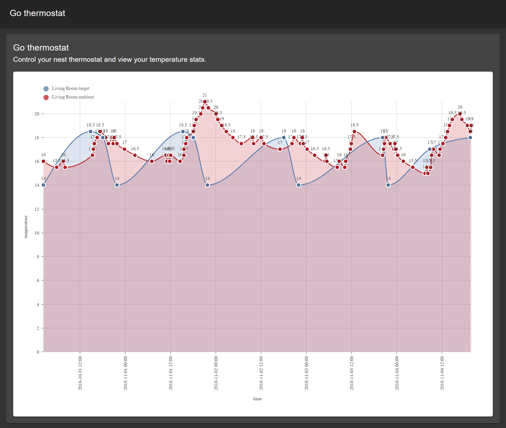

# Go Thermostat

[](https://travis-ci.org/marcofranssen/gothermostat)
[](https://github.com/marcofranssen/gothermostat/blob/master/LICENSE.md)
[](https://godoc.org/github.com/marcofranssen/gothermostat)
[](http://codecov.io/github/marcofranssen/gothermostat?branch=master)
[](https://goreportcard.com/report/github.com/marcofranssen/gothermostat)

This project enables to interact with your nest thermostat.

## Build

```bash
go build .
```

## Configure

```bash
cp dist.config.json config.json
```

Fill out your clientId, clientSecret, authCode.

### How to get your nest token

https://codelabs.developers.google.com/codelabs/wwn-api-quickstart/#2

## Run

```
./gothermostat
```

## Demo


